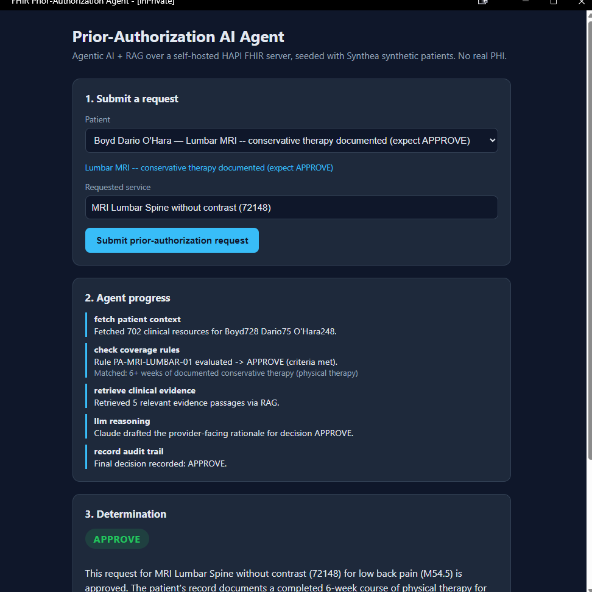
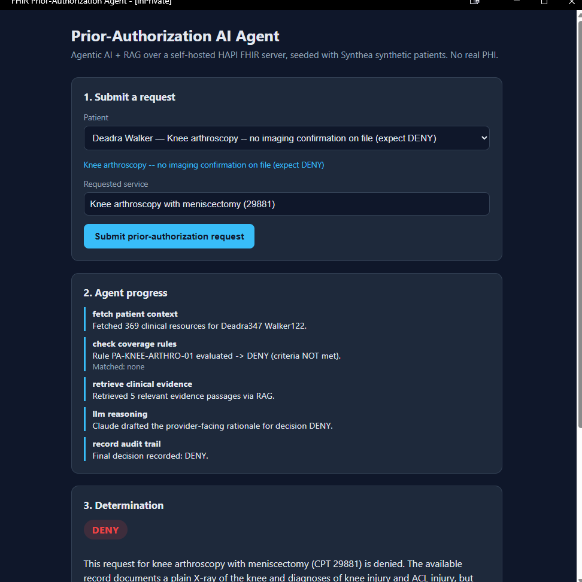

# FHIR Prior-Authorization AI Agent

An agentic AI demo that automates a healthcare-payer prior-authorization
determination against a **self-hosted, open-source FHIR server**, seeded
with **100% synthetic patients** -- no real PHI anywhere in this repo.

It exists to demonstrate, in running code, the skills behind a healthcare
AI-transformation architect role: LLM agents, RAG, HL7/FHIR, and
governance/explainability for a regulated payer workflow (prior
authorization / utilization management).

> Redox (a commercial FHIR integration platform) isn't open source, so this
> project uses genuinely open-source equivalents instead: **HAPI FHIR**
> (self-hosted FHIR R4 server) + **Synthea** (MITRE's synthetic patient
> generator) + **LangGraph** + **Claude**.

## What it does

1. Pick one of 4 synthetic patients, each pre-loaded with a realistic (but
   entirely fabricated) FHIR medical record.
2. Submit a prior-authorization request for a specific procedure.
3. Watch a LangGraph agent work through it live: fetch the patient's FHIR
   record -> check a deterministic coverage-policy rule -> retrieve
   supporting clinical evidence via RAG -> ask Claude to write a
   provider-facing rationale -> record a full audit trail.
4. Get an APPROVE / DENY / PEND determination with cited evidence and a
   step-by-step audit log.

Two scenarios are pre-loaded so the demo shows both outcomes, not just a
rubber stamp:

| Patient | Procedure | Expected result |
|---|---|---|
| Boyd O'Hara | MRI Lumbar Spine (72148) | **APPROVE** -- documented physical therapy on file |
| Alene Stiedemann | MRI Lumbar Spine (72148) | **PEND** -- no conservative therapy documented |
| Erminia Erdman | Knee arthroscopy (29881) | **APPROVE** -- MRI-confirmed meniscal tear |
| Deadra Walker | Knee arthroscopy (29881) | **DENY** -- no imaging confirmation on file |

## Screenshots

| APPROVE (documented conservative therapy) | PEND (missing documentation) |
|---|---|
|  |  |

| APPROVE (MRI-confirmed meniscal tear) | DENY (no imaging confirmation) |
|---|---|
|  |  |

See [`docs/ARCHITECTURE.md`](docs/ARCHITECTURE.md) for the full system
diagram and a table mapping each part of this repo to the underlying
AI-architecture concepts, and [`docs/COMPLIANCE_NOTE.md`](docs/COMPLIANCE_NOTE.md)
for exactly where the synthetic data came from and how it was curated.

## Workflow (animated)



The blue dot is one prior-auth request moving through the system; each step
lights up as it runs. Source: [`docs/workflow.svg`](docs/workflow.svg)
(plain SVG with CSS/SMIL animation, no JavaScript, so it also animates on
GitHub).

## Architecture at a glance

```
docker-compose.yml
├── hapi-fhir   open-source FHIR R4 server (hapiproject/hapi)
└── backend     FastAPI + LangGraph agent (Claude + Chroma RAG)
        └── serves the static frontend too, no separate build step
```

Prior-auth decisions are made by a small, unit-tested, YAML-driven rules
engine (`backend/rules/prior_auth_rules.yaml`) -- **not** by the LLM. Claude's
job is to explain that decision clearly, citing real evidence, never to
override it. Full detail in [`docs/ARCHITECTURE.md`](docs/ARCHITECTURE.md).

## Quickstart

Prerequisites: Docker Desktop, Python 3.9+ (for the one-time seed script),
and an [Anthropic API key](https://console.anthropic.com/).

```bash
cp .env.example .env
# edit .env and set ANTHROPIC_API_KEY

docker compose up -d hapi-fhir
```

Wait ~30-60s for HAPI FHIR to finish booting, then check it's up:

```bash
curl http://localhost:8080/fhir/metadata
```

Seed it with the 4 synthetic demo patients (one-time; only needs the
`httpx` package on your host):

```bash
pip install httpx
python scripts/seed_fhir_server.py
```

Start the backend (serves the UI too) and open it:

```bash
docker compose up -d backend
```

Open **http://localhost:8000** and submit a request.

> **Note:** HAPI FHIR runs with its default in-memory H2 database in this
> compose file (fine for a demo, zero setup). Data doesn't survive a
> container restart -- if `docker compose restart hapi-fhir` (or a Docker
> Desktop restart) wipes it, just re-run `python scripts/seed_fhir_server.py`.

## Why an Anthropic API key?

The key is used in exactly one place: the `llm_reasoning` step in
[`backend/app/agent/graph.py`](backend/app/agent/graph.py), where Claude
writes the provider-facing rationale for a determination. It is **not** used
to make the decision -- APPROVE / DENY / PEND comes from the deterministic
rules engine before the LLM is ever called, and Claude is instructed never
to contradict it (see [`docs/ARCHITECTURE.md`](docs/ARCHITECTURE.md)).

Claude was chosen because this project is meant to demonstrate hands-on
integration with an enterprise LLM API. The model is configurable via
`CLAUDE_MODEL` in `.env`.

## Using a different model (e.g. Ollama)

The LLM step is a single, self-contained call, so you can swap in any model
you prefer (a local Ollama model, OpenAI, Gemini, etc.) without touching the
rest of the pipeline. The shipped code is Anthropic-only; to use another
provider, edit `llm_reasoning` in `backend/app/agent/graph.py` and replace
the `anthropic.Anthropic().messages.create(...)` call. The prompt
(`SYSTEM_PROMPT` and `user_prompt`) and the returned rationale string stay
the same.

For example, with a local [Ollama](https://ollama.com/) server (`ollama pull
llama3.1`), the call could become:

```python
import httpx

resp = httpx.post(
    "http://host.docker.internal:11434/api/chat",  # Ollama on your host, from inside Docker
    json={
        "model": "llama3.1",
        "stream": False,
        "messages": [
            {"role": "system", "content": SYSTEM_PROMPT},
            {"role": "user", "content": user_prompt},
        ],
    },
    timeout=120,
)
rationale = resp.json()["message"]["content"].strip()
```

Then no `ANTHROPIC_API_KEY` is needed. Smaller local models may follow the
"never contradict the policy decision" instruction less reliably than
Claude, so review their rationales before trusting them. This Ollama snippet
is a sketch and has not been tested in this repo.

## Regenerating the synthetic data yourself

`data/patients/` and `data/reference/` are already committed, so the
quickstart above doesn't require this. If you want to generate a fresh
population and re-curate:

```bash
scripts/generate_synthetic_data.sh 150   # runs Synthea via Docker/JRE
python scripts/curate_patients.py         # selects candidates matching our 2 scenarios
python scripts/finalize_demo_patients.py  # picks the final 4, augments 2, writes scenarios.json
```

## Shareable/scriptable links

The UI supports two optional query parameters, useful for demos or docs:

- `?demo=<patient_id>` -- auto-selects that patient and submits, so you can
  link directly to one scenario running live.
- `?view=<request_id>` -- jumps straight to an already-completed request's
  result without submitting a new one (used to generate the screenshots
  above).

## Troubleshooting

- **Docker Desktop isn't running.** Start it before `docker compose up`;
  the engine takes 30-60s to become ready after launch.
- **HAPI FHIR shows no patients / a fresh `Patient?_count=1` returns
  `"total": 0`.** Its database is in-memory and doesn't survive a container
  restart. Re-run `python scripts/seed_fhir_server.py`.
- **`ANTHROPIC_API_KEY` errors with "credit balance too low."** That's a
  separate, pay-as-you-go product from any Claude.ai/Claude Code
  subscription -- add a payment method at
  [console.anthropic.com/settings/billing](https://console.anthropic.com/settings/billing).
  This demo's calls are tiny (short prompts, ~400 output tokens), so testing
  costs pennies.
- **Backend container won't start / `depends_on` hangs.** There's no
  healthcheck gating startup order (HAPI's image lacks `wget`/`curl` to run
  one) -- `backend` starts as soon as `hapi-fhir`'s container starts, not
  necessarily once it's actually ready. If the very first request fails,
  wait a few seconds and retry.
- **First request is slow (~5-10s extra).** Chroma downloads a small local
  ONNX embedding model (~80MB) on first use and caches it in the
  `chroma_model_cache` volume; subsequent runs are fast.

## Running the tests

```bash
cd backend
pip install -r requirements.txt
pytest tests/
```

## License

MIT -- see [LICENSE](LICENSE). Depends on HAPI FHIR (Apache-2.0), Synthea
(Apache-2.0), LangGraph, Chroma, and the Anthropic API.
