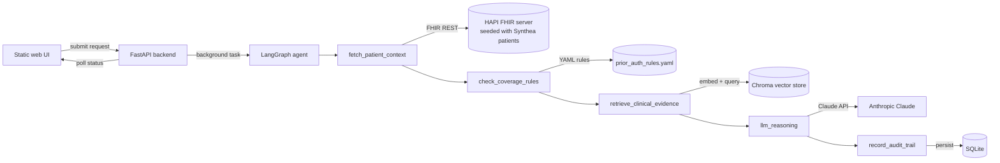

# Architecture

## Why this exists

This is a portfolio/demo project showing an agentic AI approach to a
healthcare-payer utilization-management workflow (prior authorization),
built entirely on open-source tooling and 100% synthetic data (see
[`COMPLIANCE_NOTE.md`](COMPLIANCE_NOTE.md)). It exists to demonstrate, in
running code rather than slides, the intersection of: LLM agents, RAG,
HL7/FHIR, and AI governance/explainability -- the core of an AI
Architect role in healthcare.

## System diagram

## Why a deterministic rules layer in front of the LLM

This is the single most important design decision, and it is deliberate:
**the LLM never decides APPROVE/DENY/PEND.** `check_coverage_rules`
(`backend/app/agent/rules_engine.py`) is a small, readable, unit-tested
Python function that evaluates plain criteria against the patient's FHIR
record. Claude's only job (`llm_reasoning`) is to turn that decision plus
the retrieved evidence into a clear, provider-facing written rationale --
and it is explicitly instructed never to contradict the policy result.

This mirrors how a responsible production system should work: LLMs are
excellent at synthesis and communication, poor as the sole arbiter of a
regulated, appealable decision. It is also what makes the audit trail
meaningful -- every step, not just the final answer, is inspectable.

## Mapping to enterprise AI-architect responsibilities

| JD theme | Where it shows up here |
|---|---|
| LLM agents, agentic AI, prompt engineering | `backend/app/agent/graph.py` (LangGraph state machine), `backend/app/agent/prompts.py` |
| RAG, vector databases, embeddings | `backend/app/rag/embed_store.py` (Chroma, local embeddings, per-patient collections) |
| Multi-agent / workflow orchestration patterns | 5-node LangGraph graph with typed state and a reducer-accumulated audit log |
| Prior authorization / utilization management | The entire demo scenario |
| HL7/FHIR standards | Self-hosted HAPI FHIR R4 server, Synthea-generated resources, Da Vinci-inspired rule design |
| AI governance: explainability, auditability | Deterministic rules layer + full timestamped audit trail retrievable via API |
| Security / regulated environments | No hardcoded secrets, `.env`-based config, no real PHI (see COMPLIANCE_NOTE.md) |
| Enterprise integration patterns | FHIR REST client, containerized services, clean API boundary between UI/backend/data layer |

## Honest gaps (not built here, and why)

- **Not a full Da Vinci PAS/CRD implementation.** Real Da Vinci CRD uses
  CDS Hooks (a live hook fired from the EHR at order time) and PAS defines
  specific Claim/Bundle profiles for the prior-auth request itself. This
  demo models the *decision logic* those IGs standardize, via a much
  simpler YAML rules file and a simplified request shape, to keep the build
  scoped to what one person can build and demo credibly. A real
  implementation would swap `rules_engine.py` for a CDS Hooks service and
  the request model for a proper PAS Bundle/Claim.
- **Not deployed to the cloud.** Runs locally via Docker Compose. A
  production path would put HAPI FHIR and the backend on ECS/Fargate or
  AKS/GKE equivalents, move SQLite to RDS/Cloud SQL, and put Chroma behind
  a managed vector store (e.g. pgvector, OpenSearch) for multi-instance use.
- **Two procedure codes, four patients.** Enough to show both decision
  paths (APPROVE and PEND/DENY) end-to-end without the demo becoming a data
  engineering project.
